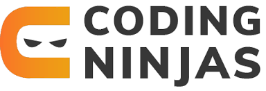

# [Coding Ninjas Full Stack Web Development Course Solutions](https://www.codingninjas.com/)

Welcome to the Coding Ninjas Full Stack Web Development Course Solutions repository! Here, you'll find meticulously crafted, optimized solutions to all the problems provided in the course. Whether you're navigating through frontend basics with HTML or delving into complex JavaScript frameworks, this repository aims to provide structured solutions to aid your learning journey.

Thank you for visiting this repository. All solutions provided here are curated to assist learners in understanding and overcoming challenges encountered during the course.

## Overview

This repository serves as a comprehensive resource hub for mastering full-stack web development with Coding Ninjas. From frontend fundamentals to backend and database problems, you'll find solutions organized in separate folders for easy navigation.

## What's Included

- Structured solutions to problems covering all milestones of the course.
- Optimized code implementations for frontend, backend, and database challenges.
- Folders dedicated to frontend basics, advanced JavaScript frameworks, backend development, and database problems.

## Getting Started

To start utilizing the resources in this repository:

1. Clone this repository to your local machine.
2. Navigate to the respective folder for the problem or milestone you want to explore.
3. Dive into the solutions provided to gain insights and understanding.

## Features

- Meticulously crafted solutions following best practices and coding standards.
- Problem-specific folders for organized access to solutions.
- Code implementations covering the entire spectrum of full-stack web development.

## Contribution

Contributions to this repository are welcome! If you have alternative solutions, improvements, or additional insights to share, feel free to open a pull request.

## Support

If you encounter any issues or have questions regarding the solutions, feel free to open an issue in the repository. We're here to help you overcome challenges and enhance your learning experience.

## License

This repository is licensed under the [MIT License](LICENSE). You are free to use the solutions for personal or educational purposes, in accordance with the terms outlined in the license file.

---

We hope you find this repository invaluable in your journey of mastering full-stack web development with Coding Ninjas. Happy coding!

Happy Coding!!!🎖️🚀😇
